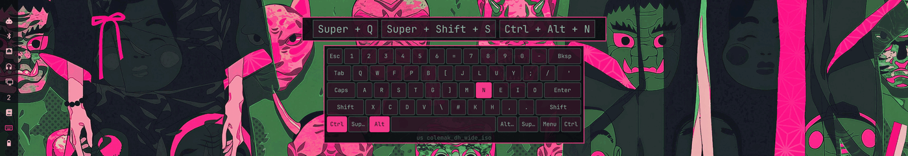
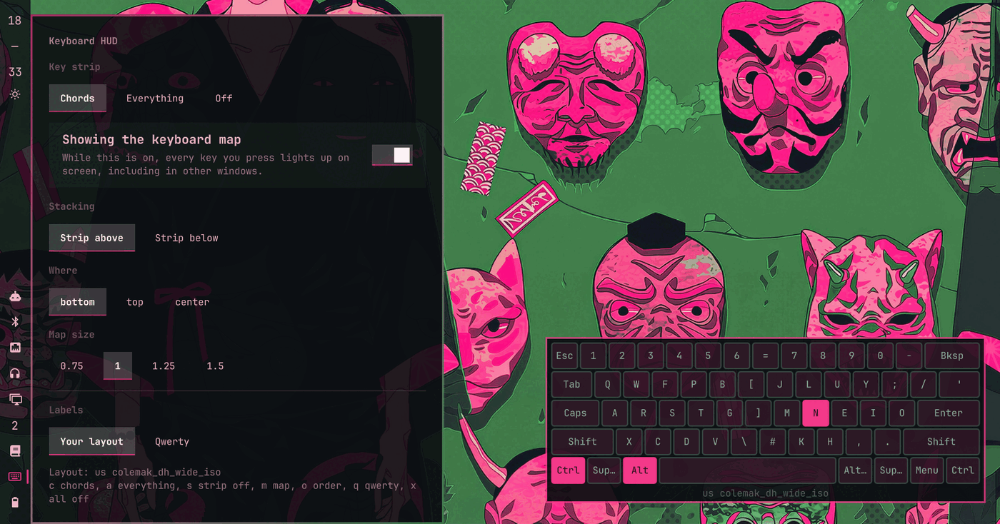

# omarchy-keyboard-hud

Two ways of showing what you are typing, in one plugin: a **strip** of the keys
and chords you just pressed, and a **map** of the whole keyboard that lights up
the keys you are holding.



They stack, in either order, so you can have the chord names above the board or
below it. Either half can be off.

The map is labelled from the keyboard layout you actually have loaded. On a
colemak machine it reads colemak, on a dvorak machine it reads dvorak, and the
key positions stay where they physically are.

It comes from two earlier plugins of mine, `omarchy-key-visualizer` for the
strip and `omarchy-keyboard-minimap` for the map, both now archived. It has not
drifted from either of them: each half still does what its own plugin did, and
the only change is that one plugin holds both. That is what lets them stack,
which they could not do while neither knew the other existed.

## Read this before installing

While either half is on, this plugin is being handed **every keypress from
every window**, including keys typed into password prompts. That is what an on
screen keyboard is, and there is no version of it that watches only the
interesting keys.

What this one does about it:

- **The strip defaults to chords**, which means a plain character key with no
  modifier held is dropped inside [keyfeed.lua](keyfeed.lua) and never written
  anywhere. Modifier combinations get through, as do keys that carry no text of
  their own: arrows, Escape, Tab, the function row.
- **The map is off until you turn it on**, and it is the half that necessarily
  sees everything, because "which keys are held" is what it draws.
- **Turning something off stops the recording**, not just the drawing. With both
  halves off there is no subscription at all, so Hyprland is not handing
  [keyfeed.lua](keyfeed.lua) keystrokes in the first place.
- **The Lua side opens no file it did not create.** The two settings that decide
  what may be recorded are pushed in by the bar widget with `hyprctl eval`, so
  the callback that runs on the input thread never opens a path another process
  could replace first. The feed itself is staged under a private name and
  renamed into place, which replaces a symlink planted there instead of writing
  through it.
- **Off stays off.** Every switch in the panel is written to this plugin's entry
  in `~/.config/omarchy/shell.json`, so what you last chose is what you get back
  after a reboot, a shell restart or a plugin reload. Until the bar has pushed
  its settings, [keyfeed.lua](keyfeed.lua) is off and records nothing.
- **Only keycodes are written, never characters**, and only into
  `$XDG_RUNTIME_DIR`, which systemd creates as mode 0700 and wipes at logout.
  Nothing is kept between sessions and nothing leaves the machine.
- **The feed is inert until you wire it in** with a command you run on purpose,
  and `bin/keyfeed-install --uninstall` takes it back out.

Right clicking the bar button turns both halves off in one go. That is the
thing to reach for before typing a password on a shared screen.

## Install

```sh
omarchy plugin add https://github.com/sterre-g/omarchy-keyboard-hud.git --enable
omarchy plugin enable sterre.keyboard-hud --section right
~/.config/omarchy/plugins/sterre.keyboard-hud/bin/keyfeed-install
```

The last command appends two lines to `~/.config/hypr/hyprland.lua`, keeps a
timestamped backup beside it, and reloads Hyprland. Check or undo with
`bin/keyfeed-install --status` and `--uninstall`.

## Using it

Left click the bar button for the panel, right click to turn everything off and
on again. The panel sets the strip mode, the map, which of the two sits on top,
where on screen they sit, and how big the map is.



Keys in the panel: `c` chords, `a` everything, `s` strip off, `m` map,
`o` swap the order, `x` all off.

```sh
omarchy-shell sterre.keyboard-hud status
omarchy-shell sterre.keyboard-hud strip chords     # chords, all, off
omarchy-shell sterre.keyboard-hud map on           # on, off
omarchy-shell sterre.keyboard-hud order strip-below
omarchy-shell sterre.keyboard-hud position top-left
omarchy-shell sterre.keyboard-hud off
```

## Where it sits

Nine places, the corners and the side edges as well as the middle:

```
top-left       top       top-right
left          center          right
bottom-left   bottom   bottom-right
```

The panel lays these out as a three by three grid, so the button you press sits
where the cards will. `top`, `center` and `bottom` still mean the middle column,
so a config from before this existed keeps drawing where it did.

Both halves move together. The corners are the ones to reach for when you record
with a webcam in one, or keep a bar along an edge.

## Following your layout

The map draws physical key positions, which do not move, and asks the system
what each one currently produces:

```sh
hyprctl -j devices                  # which keyboard, which layout and variant
xkbcli compile-keymap --layout us --variant colemak_dh_wide_iso
```

The compiled keymap is parsed for `<AD01> = 24` style keycodes and their symbol
lists, so the labels come from the same source Hyprland is using rather than
from a table per layout shipped in here. A layout switch or a config reload
re-reads it.

One wrinkle worth knowing: the keyboard Hyprland marks as `main` is often an
input method's virtual keyboard, which carries no variant. The plugin prefers a
real device that has one, and you can override both with the `layout` and
`variant` settings if it still picks wrong. The name of whatever it settled on
is printed under the map.

If the keymap cannot be read, the map falls back to US labels rather than
showing nothing.

## How it works

[keyfeed.lua](keyfeed.lua) is the only thing that sees your keys. It tracks
which are held, decides per event what is allowed out, and writes one small
JSON object to `$XDG_RUNTIME_DIR/sterre-keyboard-hud.json`: the chord for the
strip, the held set for the map, each only if that half is on. It reads nothing:
the bar widget pushes the two recording settings in with `hyprctl eval`, and the
feed is written to a fresh private name and renamed over the target, so neither
half of the exchange opens a path someone else can have replaced. Its behaviour
is covered by [test/keyfeed.test.lua](test/keyfeed.test.lua), which stands in for
the Hyprland API and includes the symlink case.

[Overlay.qml](Overlay.qml) watches that file and draws both cards, one
`PanelWindow` per screen, never taking keyboard focus so it can sit there while
you type into something else, and with an empty input region so it never takes
a click either. Both matter: it is a full width strip along an edge, so without
that it would cover whatever the bar has there. [Panel.qml](Panel.qml) is the bar
widget: it owns the settings, pushes the recording switches to the Lua side, and
writes the rest to `$XDG_RUNTIME_DIR/sterre-keyboard-hud.conf` for the overlay to
pick up.

[Model.js](Model.js) holds the physical layout, the keymap parser, chord
ordering, repeat collapsing and expiry, and the layout picking. It is covered by
[test/model.test.js](test/model.test.js) against two real compiled keymaps
checked in as fixtures, including a test that qwerty and colemak genuinely
produce different labels for the same keycodes.

## Development

```sh
./run-tests
./dev-sync
omarchy plugin validate ~/.config/omarchy/plugins/sterre.keyboard-hud
omarchy-shell shell rescanPlugins
```

Editing the overlay hot reloads. Adding a new file to an installed plugin needs
`omarchy restart shell`, otherwise Qt serves a cached directory listing.

## License

MIT, see [LICENSE](LICENSE).
